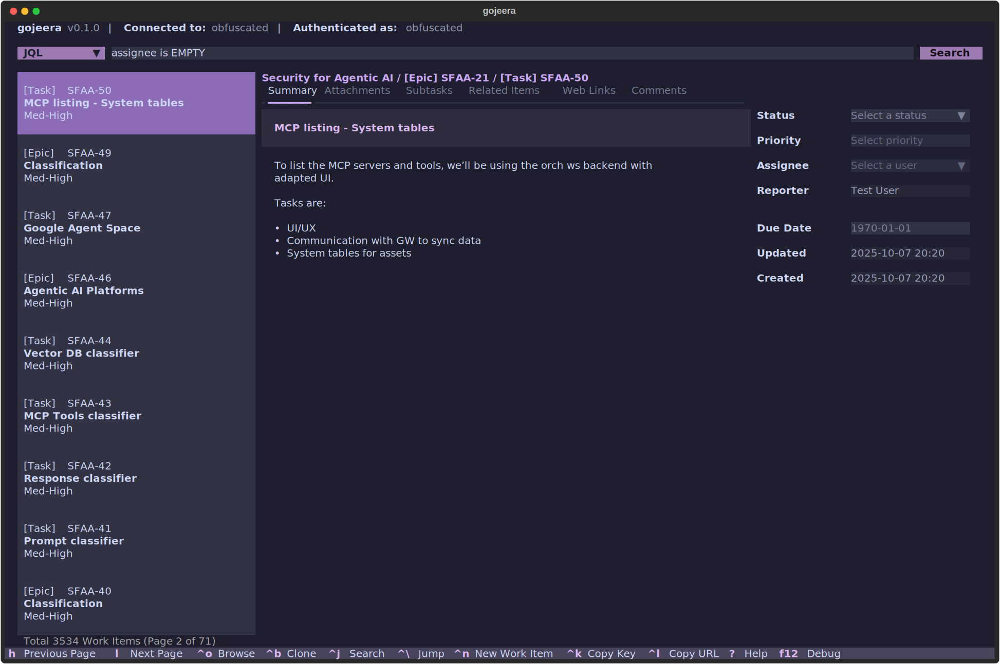

# gojeera

> [!IMPORTANT]
> This project is under active development!



A **Text User Interface (TUI)** for interacting with Atlassian Jira directly
from terminal.

## Introduction

**gojeera is a fork of <https://github.com/whyisdifficult/jiratui>.**

gojeera is built using the [Textual](https://textual.textualize.io/) and [Rich](https://rich.readthedocs.io/en/latest/)
frameworks.

It supports the [Jira Cloud Platform REST API v3](https://developer.atlassian.com/cloud/jira/platform/rest/v3/intro/).

## Installation

The recommended way to install the application is via [uv](https://docs.astral.sh/uv/):

```bash
uv tool install git+https://github.com/vkhitrin/gojeera
```

Alternatively, you can install it using `pip`:

```bash
pip install git+https://github.com/vkhitrin/gojeera
```

Or `pipx`:

```bash
pipx install git+https://github.com/vkhitrin/gojeera
```

After installing the package, you can run the CLI tool with the following
command:

```bash
gojeera --help
```

This will show you the available commands for the CLI tool

```bash
uv run gojeera --help
Usage: gojeera [OPTIONS]

  Launches the gojeera TUI application.

Options:
  -p, --project-key TEXT          A case-sensitive Jira project key.
  -w, --work-item-key TEXT        A case-sensitive work item key.
  -u, --assignee TEXT             A Jira user display name or account ID to
                                  pre-select in the assignee dropdown.
  -j, --jql-filter TEXT           The label of a JQL filter query to load on
                                  startup, as defined in the config.
  -t, --theme TEXT                The name of the theme to use.
  --search-on-startup             Trigger search automatically when the UI
                                  starts.
  -f, --focus-item-on-startup INTEGER
                                  Focus and open the work item at the
                                  specified position on startup. Requires
                                  --search-on-startup.
  --version                       Show the version of the tool.
  --help                          Show this message and exit.
```

## Usage

Visit [usage.md](./src/gojeera/usage.md).

## Configuration

Visit [configuration.md](./docs/configuration.md).

## Acknowledgments

[@whyisdifficult](https://github.com/whyisdifficult) and the various contributors to
<https://github.com/whyisdifficult/jiratui>.

## Similar and Complementing Projects

- <https://github.com/whyisdifficult/jiratui> - the original TUI.
- <https://github.com/ankitpokhrel/jira-cli> - CLI with many features.
- <https://developer.atlassian.com/cloud/acli/guides/introduction/> - official Atlassian CLI.
