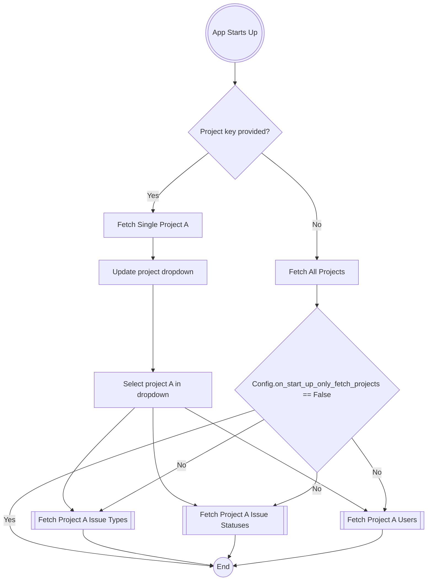
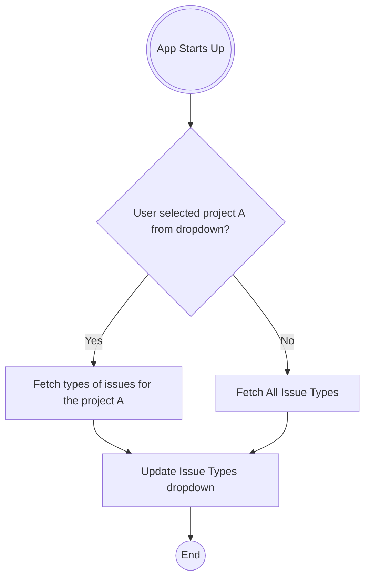
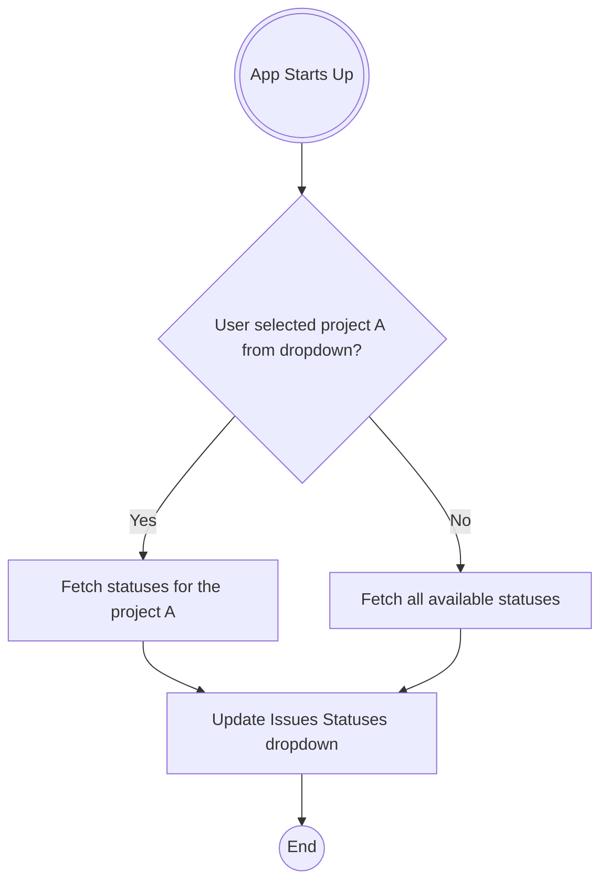
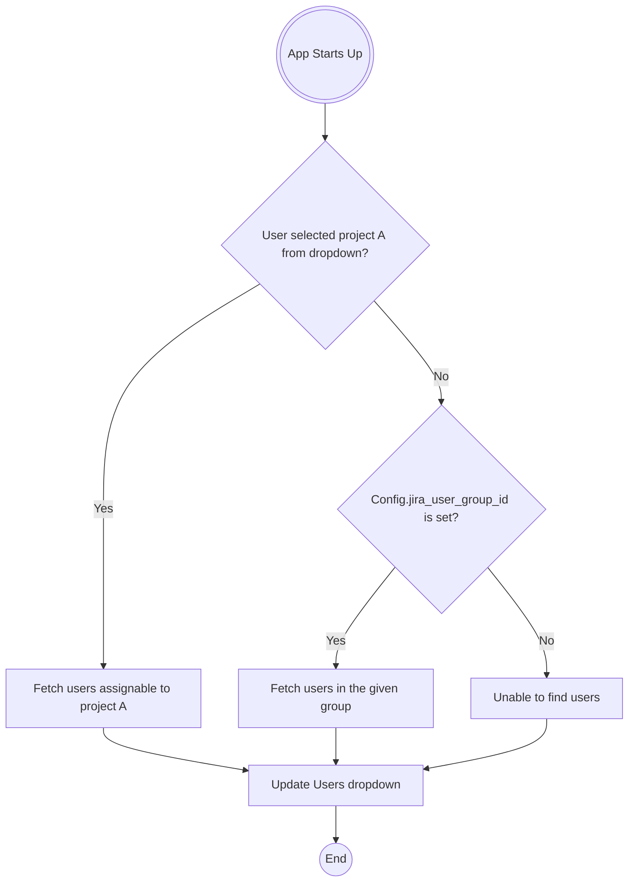

# Usage

## Shell Completions

gojeera supports shell completion scripts for bash, zsh, and fish. To generate
a completion script, use:

```bash
gojeera completions [bash|zsh|fish]
```

You can then follow your shell's instructions to enable completions.
For more details, see the [Click documentation on shell completion](https://click.palletsprojects.com/en/latest/shell-completion/).

## Launching the UI

Once the application has been configured, run the command:

```bash
gojeera ui
```

It is possible to use a custom configuration file:

```bash
GOJEERA_CONFIG_FILE=/path/to/config.yaml gojeera ui
```

## Passing Optional Arguments to the UI

`gojeera ui` supports optional arguments that you can use to set options in the
UI upon start up. You can view the list of supported arguments with the
following command:

```bash
$ gojeera ui --help
Usage: gojeera ui [OPTIONS]

  Launches the gojeera application.

Options:
  -p, --project-key TEXT           A case-sensitive Jira project key.
  -w, --work-item-key TEXT         A case-sensitive key of a work item.
  -u, --assignee-account-id TEXT   A Jira user account ID. Typically this would be your Jira account ID so user-related
                                   dropdowns can pre-select your user
  -j, --jql-expression-id INTEGRER The ID of a JQL expression as defined in the config.
  -t, --theme TEXT                 The name of the theme to use.
  --search-on-startup              Trigger search automatically when the UI starts.
  --focus-item-on-startup INTEGER  Focus and open the work item at the specified position on startup. Requires --search-on-startup.
```

## Trigger Search on Startupa

To automatically perform a search as soon as the UI starts, use
the `--search-on-startup` flag:

```bash
gojeera ui --search-on-startup
```

## Focus on a Specific Work Item on Startup

> [!IMPORTANT]
> The `--focus-item-on-startup` flag requires `--search-on-startup` to be enabled.
> The position must be a positive integer (1 or greater) and should not exceed the number of items returned by the search.

To automatically focus on and open a specific work item from the search results,
use the `--focus-item-on-startup` flag with a position number.
This flag requires `--search-on-startup` to be enabled.

The position number is 1-based, meaning `1` refers to the first item in the
search results, `2` refers to the second item, and so on.

```bash
gojeera ui --search-on-startup --focus-item-on-startup 1
```

This is useful when combined with other filters. For example, to automatically
open the first item of a specific project:

```bash
gojeera ui --project-key PROJECT-1 --search-on-startup --focus-item-on-startup 1
```

Or to open the third item from a JQL expression search:

```bash
gojeera ui --jql-expression-id 1 --search-on-startup --focus-item-on-startup 3
```

## Selecting a Theme

gojeera allows you to set the theme of the UI when you launch it.
Currently, the application supports the themes
predefined by [textual](https://textual.textualize.io/guide/design/#themes).

You can list the supported themes with the `gojeera themes` command:

```bash
$ gojeera themes

┏━━━━━━━━━━━━━━━━━━┳━━━━━━━━━━━━━━━━━━━━━━━━━━━━━━━━━━━━━┳━━━━━━━━━━━━━━━━━━━━━━━━━━━━━━━━━━┓
┃ Name             ┃ Usage via CLI                       ┃ Usage via Config                 ┃
┡━━━━━━━━━━━━━━━━━━╇━━━━━━━━━━━━━━━━━━━━━━━━━━━━━━━━━━━━━╇━━━━━━━━━━━━━━━━━━━━━━━━━━━━━━━━━━┩
│ textual-dark     │ gojeera ui --theme textual-dark     │ config.theme: "textual-dark"     │
│ textual-light    │ gojeera ui --theme textual-light    │ config.theme: "textual-light"    │
│ nord             │ gojeera ui --theme nord             │ config.theme: "nord"             │
│ gruvbox          │ gojeera ui --theme gruvbox          │ config.theme: "gruvbox"          │
│ catppuccin-mocha │ gojeera ui --theme catppuccin-mocha │ config.theme: "catppuccin-mocha" │
│ textual-ansi     │ gojeera ui --theme textual-ansi     │ config.theme: "textual-ansi"     │
│ dracula          │ gojeera ui --theme dracula          │ config.theme: "dracula"          │
│ tokyo-night      │ gojeera ui --theme tokyo-night      │ config.theme: "tokyo-night"      │
│ monokai          │ gojeera ui --theme monokai          │ config.theme: "monokai"          │
│ flexoki          │ gojeera ui --theme flexoki          │ config.theme: "flexoki"          │
│ catppuccin-latte │ gojeera ui --theme catppuccin-latte │ config.theme: "catppuccin-latte" │
│ solarized-light  │ gojeera ui --theme solarized-light  │ config.theme: "solarized-light"  │
└──────────────────┴─────────────────────────────────────┴──────────────────────────────────┘
```

The default theme is `textual-dark`.

To start the UI with a different theme you can pass the name of the theme to
the `ui` command. For example, the following command will start the UI with the
theme `dracula`.

```bash
gojeera ui --theme dracula
```

For more details refer to [Choosing a Theme](../docs/configuration.md#choosing-a-theme)

## Select a Jira Project on Start Up

> [!TIP]
> You can configure a default by setting the variable `default_project_key_or_id`
> in the configuration file.

If you wish to pre-select a project in the projects dropdown you can
pass the project key with the argument `--project-key`. If the project exists the app will pre-select it.

```bash
gojeera ui --project-key PROJECT-1
```

## Select a Jira User on Start Up

> [!TIP]
> You can configure a default by setting the variable `jira_account_id` in the config
> file. That way you do not need to pass this argument when you start the app.

If you wish to pre-select your Jira user in the assignee dropdown you can set
the user account ID with the argument `--assignee-account-id`.
If the user exists the app will pre-select
it.

```bash
gojeera ui --assignee-account-id 12345-67890
```

## Select a Jira Work Item on Start Up

If you wish to pre-select a Jira issue in the `work item key` field you can
pass the work item key with the argument `--work-item-key`.

```bash
gojeera ui --work-item-key ISSUE-1
```

## Select a Jira JQL Expression on Start Up

> [!TIP]
> You can configure a default by setting the variable `jql_expression_id_for_work_items_search` in the
> config file. That way you do not need to pass this argument when you start the app.

If JQL expressions are defined in `pre_defined_jql_expressions` configuration,
pass `--jql-expression-id` with the expression ID to search work items when
no other criteria is selected.

```bash
gojeera ui --jql-expression-id 1
```

## Using the UI

### Navigation

> [!DANGER]
> This will change in future versions!

You can move around in the UI with the `tab` key or, by using your mouse.
However, if you want to move faster you can
jump to some of the components by pressing a single key.

Some components in UI indicate between parenthesis the key that
you can use to jump to them. For example, to quickly jump to the
Project dropdown you can simply click `p`. If the focus
is currently on a component you need to press `esc` to move the focus out of
the current component and then press the
key you desire. The following table summaries the hot-keys and the component
they activate.

| Key | Component                                         |
| --- | ------------------------------------------------- |
| `p` | Activates the Project dropdown                    |
| `t` | Activates the Issue Type dropdown                 |
| `s` | Activates the Status dropdown                     |
| `a` | Activates the Assignee dropdown                   |
| `k` | Activates the Work Item Key input                 |
| `f` | Activates the Created From input                  |
| `u` | Activates the Created Until input                 |
| `o` | Activates the Sort dropdown                       |
| `v` | Activates the Active Sprint checkbox              |
| `j` | Activates the JQL Query input                     |
| `1` | Activates the Work Items search result table/pane |
| `2` | Activates the Info tab                            |
| `3` | Activates the Details tab                         |
| `4` | Activates the Comments tab                        |
| `5` | Activates the Related tab                         |
| `6` | Activates the Attachments tab                     |
| `7` | Activates the Links tab                           |
| `8` | Activates the Subtasks tab                        |

When you select a work item from the Work Items search results pane and click
`enter` the information of the work item
is loaded into the tabs on the right-hand side.
Depending on the tab that is active certain hot-keys are enabled:

| Key         | Active Tab/Component | Action                                                                     |
| ----------- | -------------------- | -------------------------------------------------------------------------- |
| `^s`        | Details              | Saves change to a work item                                                |
| `^k`        | Details              | Copies the key of the work item currently selected                         |
| `^j`        | Details              | Copies the URL of the work item currently selected                         |
| `^l`        | Details              | View the work log                                                          |
| `^t`        | Details              | Log work for a work item                                                   |
| `^f`        | Details              | Add/Remove flag to work item                                               |
| `d`         | Worklogs             | Delete a work log                                                          |
| `^o`        | Worklogs             | Open worklog in the browser                                                |
| `n`         | Comments             | Add a new comment to the work item                                         |
| `n`         | Related              | Add a new related item to the work item                                    |
| `enter`     | Related              | View the related item                                                      |
| `d`         | Related              | Deletes the related item                                                   |
| `^o`        | Related              | Opens file in the browser                                                  |
| `^u`        | Attachments          | Attach file to the work item                                               |
| `d`         | Attachments          | Deletes an attachment                                                      |
| `v`         | Attachments          | View the content of the attached file                                      |
| `n`         | Links                | Link item to the work item                                                 |
| `d`         | Links                | Deletes a link                                                             |
| `^n`        | Subtasks             | Create a new subtask of the work item                                      |
| `.`         | Search Results       | Enables filtering of results in the results table                          |
| `alt+right` | Search Results       | Retrieves the next page of results                                         |
| `alt+left`  | Search Results       | Retrieves the previous page of results. This is only enabled when page > 1 |
| `^k`        | Search Results       | Copies the key of the work item currently selected                         |
| `^j`        | Search Results       | Copies the URL of the work item currently selected                         |
| `^e`        | JQL Query field      | Opens the JQL Query Editor                                                 |

Besides the hot-keys above the following are always available.

| Key      | Action                                                                 |
| -------- | ---------------------------------------------------------------------- |
| `ctrl+r` | Searches work items (this is the same as clicking the "Search" button) |
| `/`      | Enables full-text search                                               |
| `ctrl+n` | Creates a new work item                                                |
| `f1`     | Shows this help                                                        |
| `f2`     | Shows server information                                               |
| `f3`     | Shows the currently loaded settings                                    |

Keybinds are always displayed at the footer.

### Searching Work Items

gojeera supports several ways to search work items.

#### Search Using Filters

You can use the filters at the top of the app to setup the criteria you want to
use for searching work items. Once
you select the desired values simply click `ctrl+r` or, click the `Search`
button.

The maximum number of results that the app will retrieve and show is controlled
by the setting
`search_results_per_page`. The default value is 30. If the search criteria
yields work items the app will display them in the Work Items pane on the left.

##### Search by Work Item Key

This expects a case-sensitive string. If defined, this has precedence
over other search criteria.

##### Search by Work Item Type

> [!IMPORTANT]
> List of work items may contain types with duplicated names when there is no project selected.
> The id of these types will be different though.

Search work items based on their type. If a project is selected then this list
will contain the type of work items
supported by the project. If no project is selected then this list will contain
all the types of work items available
in the known projects.

##### Search by Status

Search work items based on their status. If a project is selected then this list
will contain the statuses supported by
the work types in the project. If no project is selected then this list will
contain all possible statuses.

##### Search by Assignee

Search work items based on their assignee. If a project is selected then this
list will contain the active users that
can have work items assigned in the project. If no project is selected then this
list will contain all available
(active) users.

##### Search by Creation Date

If defined, only work items that were created after this date
(inclusive) will be fetched.

If no `Created From` and `Created Until` search criteria are defined then the
application will fetch work items created
within the last 15 days. The number of days can be specified by
the configuration variable
`search_issues_default_day_interval`.

##### Search by Active Sprint

When this checkbox is selected the application will filter work items that
correspond to the currently active sprint.

#### Searching Using Full-Text Search

> [!IMPORTANT]
> Full-text search is only available when you connect to the Jira Cloud Platform. This feature is not
> available when you connect to Jira Data Center (aka. server, on-premises).

In addition to searching using the filters above, gojeera allows you to search
items using full-text
search. This type of search has 2 modes: standard and advanced.

- **Standard Full-text Search**: this modes searches items using the items'
  summary and description fields. This uses
  queries of the form `summary ~ "search term" OR description ~ "search term"`.

- **Advanced Full-text Search**: in addition to searching items using the items'
  summary and description fields, this
  modes also searches items by using any text-based field. This includes comments.
  This uses
  queries of the form `text ~ "search term".

If you wish/need to disable advanced full-text search you can do so with the setting
`enable_advanced_full_text_search`. Also, the setting
`full_text_search_minimum_term_length` controls the minimum
length of the search term to activate the search. gojeera imposes a minimum of
3 characters at all times.

For more details on full-text search in Jira refer to
<https://support.atlassian.com/jira-software-cloud/docs/jql-fields/#Text>) and
<https://support.atlassian.com/jira-software-cloud/docs/search-for-work-items-using-the-text-field/>.

To activate full-text search press `/`. Enter the search term in the pop-up and hit `enter`.

#### Searching Using JQL Expressions

Another way to search work items in gojeera is by using
[JQL](https://support.atlassian.com/jira-service-management-cloud/docs/use-advanced-search-with-jira-query-language-jql/).
by using the JQL input field. In addition, you can also define your own JQL
query expressions and save them in the config file using the
setting `pre_defined_jql_expressions`. This is a YAML dictionary of expressions.
When you focus on the JQL Query input
field (`j`) and press `ctrl+e` the JQL Editor opens.

For example, Search work items assigned to John Smith

```python
assignee = "John Smith"
```

Or searching by the user's email address:

```python
assignee = "john@smith.com"
```

### Filtering Search Results

Search results can be filtered as well. In order to do this simply focus on the results table by pressing `1` and then
press `.`. This opens up an input field where you can enter the term you want to use to filter the results further.
Items are filtered by their `summary` field. Keep in mind that the filtering only applies to the current page.

This feature is controlled by the setting `search_results_page_filtering_enabled`. The minimum length of the search
term is controlled by the setting `search_results_page_filtering_minimum_term_length`; the default is 3.

```{tip}
Pressing `escape` hides the search box.
```

### Setting Search Filters

The 4 filters at the top are linked together.

When you choose a project from the Projects dropdown
the possible options for the types of issues filter, applicable
status codes filters and the list of users (assignee)
get automatically updated. The values of these 3 filters may
vary with each project.

The interaction between these 4 filters is depicted in the following flowchart.



### Projects List

The list of projects depends on the permissions of the logged-in user.
For a project to appear on this list
one of these conditions must be satisfied:

- The user Jira account must have the [Browse Projects project permission](https://confluence.atlassian.com/x/yodKLg)
  for the project.
- The user Jira account must have
  the [Administer Projects project permission](https://confluence.atlassian.com/x/yodKLg)
  for the project.
- The user Jira account must have the [Administer Jira global permission](https://confluence.atlassian.com/x/x4dKLg).

By default, gojeera will retrieve all available projects. However, if you set
the config variable
`default_project_key_or_id` with a case-sensitive project key then the app will
only fetch and load that project. If
no project is found or the user does not have permissions to browse projects
then the list will be empty.

### Issues Types List

If you select a project, gojeera will retrieve all the applicable issue
types for the selected project. If no
project is selected then the list of issue types will include all
known issue types. Keep in mind that in this case the
dropdown may contain types with the same name; because they belong to different
projects. The following flowchart shows
how the list of issues types gets populated.



#### Issue Status Codes

If you select a project, gojeera will retrieve all the applicable status codes
applicable to the issue types of the
selected project. If no project is selected then the list of statuses
will include all known status codes. Keep in mind
that in this case the dropdown may contain statuses with the same name;
because they belong to different projects. The
following flowchart shows how the list of issues statuses gets populated.



### List of Users

> [!IMPORTANT]
> Fetching users by group id is only supported in the Jira Cloud Platform.

If you select a project, gojeera will retrieve all the users that can be assigned
issues in the given
project. Otherwise, the app will attempt to find all the users that belong
to the group ID defined in `jira_user_group_id`.

The following flowchart shows how the list of users/assignee gets populated.



### Creating Work Items

To create a work item you can press `ctrl+n`. This will open up a modal screen
with a form to provide the necessary fields to create the work item.
Fields marked with `(*)` are required.

If the item is created successfully a message will pop up in the app indicating
the work item key.

### Updating Work Items

The "Details" tab on the right-hand side shows the details of the currently
selected work item. The tab displays a form
with the fields that are supported by the app. Some of these fields can be
updated. The list of fields that can be
updated include the following:

- Summary
- Assignee
- Status
- Priority
- Due Date
- Labels
- Parent
- Components
- Labels

In addition to the fields above the application supports updating (some) custom
field types and some system field
types. Currently, the list of custom fields that can be updated include the
following:

- `userpicker`: Field to select a user.
- `float`: Field to provide a numeric value.
- `datepicker`: Field to provide a date value, e.g. `2025-12-31`.
- `datetime`: Field to provide a date/time value, e.g. `2025-12-31 13:34:55`.
- `float`: Field to provide a number, e.g. `12.34`.
- `textfield`: Field to provide string as value.
- `select`: Field to select a single option out of a list of available options.
- `multiselect`: Field to select multiple options out of a list of available
  options.
- `multicheckboxes`: Field select multiple options out of a list of available
  options.
- `url`: Field to provide a URL.
- `sd-request-language`: Field to provide Atlassian Service Desk request
  language.

By default, gojeera does not allow users to view and update the fields in the
above. To enable this feature you can set
the variable `enable_updating_additional_fields: True` in the
configuration file.

In order to update a field simply focus on it, change its value and then
press `^s` to save the changes.

Some of the fields require a modal to pop up to allow the user to select values
for the field.

### Updating Parent of a Work Item

Jira arranges the type of issues into a hierarchy. This hierarchy is used to
determine whether an issue can have
another issue as a parent. For example, an Epic can not have a parent issue.
Issues of type Story, Task, Bug and Subtask do accept parents.

### Updating Priority of a Work Item

> [!IMPORTANT]
> Once an issue has a priority set up it can not be unset.

### Updating Components of a Work Item

If your Jira project configures a `components` field for the issues in the
project then the application will allow you
to view and update the components associated to a work item. If you do not see
the input field to view and update this
field then the probable reason is that your Jira project does not support this
field.

### Updating Labels of a Work Item

If your Jira project configures a `labels` field for the issues in the
project then the application will allow you
to view and update the labels associated to a work item. If you do not see
the input field to view and update this
field then the probable reason is that your Jira project does not support this
field.

Existing labels are fetched directly from the Jira instance and are
suggested to the user.

### Comments

A tab which displays comments associated to the selected work item.

Comments can be deleted by focusing on them and then
pressing `d`.

Comments can be added by pressing `n`.

### Related Work Items

A tab which displays a summary of all the work items related to the item currently
selected.

Pressing `n` allows the user to add new related work items while focusing on a
related item and then pressing `d` will
delete the item.

To view the details of a related item, focus on the item and then press `v`.

### Attachments

> [!IMPORTANT]
> In order to open attachments in the default browser the user **MUST** be logged into the browser.
>
> [!IMPORTANT]
> Uploading large files may cause the UI to be unresponsive temporarily. This will depend on the size of
> the file.
>
> [!WARNING]
> The application imposes a maximum file size of 10MB.

A tab which displays a list of files attached to the selected work item.

To upload a file press `^u` and provide the details in the pop-up that opens.
To delete an attachment focus on the
attached file you want to delete and then press `d`.

When the user selects the attachment and presses `enter`
(or clicks on the attachment row) the app will attempt to
download the file display its content in the terminal. In addition,
after selecting/highlighting an attachment the user
can press `^o` to open the file in the browser.

### Web Links

A tab which displays a list of URLs associated to the selected work item.

To add a new link simply press `n` and provide the details in the pop-up that
opens. To delete a link simply focus on
the title of the collapsible whose link you want to delete and then press `d`.

### Subtasks

A tab which displays a list of work items that are a subtask of the selected
work item. A work item `A` is a subtask of
another work item `B` if the parent of `A` is `B`.

### Worklogs

The "Details" tab also allows you to log work for a given work item.
To do so you can press `^t` to open a pop-up screen
that will allow you to indicate the amount of time you work on a task,
the date/time and an optional description.

Moreover, to view the work log associated to a work item you can press
`^l` in the "Details" tab. This will open up a
pop-up screen that will display the work done on the task.
Selecting 1 log in the list and pressing `d` allows you to
delete the entry. You can also press `^o` to open a worklog details in the
browser.

### Flagging Work Items

You can add/remove a flag to a work item by pressing `^f` while in the details
tab. When you add a flag to an item you
can add an optional message to let your team know why the task is (not) flagged.

## CLI Interface

> [!DANGER]
> This might be deprecated in future versions!

In addition to the `ui` command, the CLI tool offers several commands to help you
manage issues, comments, and
users.

### Searching for Issues

The CLI has a command to search work items by different criteria.

```bash
$ gojeera issues search --help
Usage: gojeera issues search [OPTIONS]

  Search work items.

Options:
  -p, --project-key TEXT          A case-sensitive key that identifies a project.
  -k, --key TEXT                  A case-sensitive key that identifies a work item.
  -u, --assignee-account-id TEXT  The account ID of a user to filter work items.
  -l, --limit INTEGER             The number of work items to return. Default is 10 items within the last 15 days.
  --created-from [%Y-%m-%d]       Searches issues created from this date forward (inclusive). Expects YYYY-MM-DD
  --created-until [%Y-%m-%d]      Searches issues created until this date (inclusive). Expects YYYY-MM-DD
```

To search for work items in the project `SCRUM`, use the issues search command
and pass the `--project-key` argument
with the (case-sensitive) project key.

**Example**: searching for issues of the project `SCRUM`

```bash
$ gojeera issues search --project-key SCRUM

| Key     | Type | Created          | Status (ID)   | Reporter          | Assignee          | Summary                                    |
|---------|------|------------------|---------------|-------------------|-------------------|--------------------------------------------|
| SCRUM-1 | Bug  | 2025-07-31 15:55 | To Do (10000) | lisa@simpson.com  | bart@simpson.com  | Write 100 times "I will be a good student" |
| SCRUM-2 | Task | 2025-06-30 15:56 | To Do (10000) | homer@simpson.com | homer@simpson.com | Eat donuts                                 |
```

To search for a specific work item, use the issues search command with the `--key` (or `-k`) argument and the (case-sensitive)
issue key.

**Example**: searching for the issue with key `SCRUM-1`

```bash
$ gojeera issues search --key SCRUM-1

| Key     | Type | Created          | Status (ID)   | Reporter          | Assignee          | Summary                                    |
|---------|------|------------------|---------------|-------------------|-------------------|--------------------------------------------|
| SCRUM-1 | Bug  | 2025-07-31 15:55 | To Do (10000) | lisa@simpson.com  | bart@simpson.com  | Write 100 times "I will be a good student" |
```

The command allows you to limit the number of items you search. Simply pass the
`-l` argument with the number of items
you want to retrieve. In addition, you can filter items based on the creation
date with the arguments `--created-from`
and `--created-until`.

### Show Metadata

The tool also provides a command to show metadata associated to a work item.
This is useful when you need to update a
work item; for example if you want to transition the state of the item and you
need to know the ID of the state.

```bash
$ gojeera issues metadata SCRUM-1

Valid work types for work item: SCRUM-1

| ID     | Name | Current?  | Description                                 |
|--------|------|-----------|---------------------------------------------|
| 1      | Bug  | Yes       | Tasks track small, distinct pieces of work. |
| 2      | Task |           | Bugs track problems or errors.              |

Valid priority IDs for work item: SCRUM-1

| ID     | Name | Current?  | Example   |
|--------|------|-----------|-----------|
| 1      | High  |          |           |

Valid status transitions for work item: SCRUM-1

| Transition ID  | Status ID | Status Name  | Current?   | Example                                      |
|----------------|-----------|--------------|------------|----------------------------------------------|
| 1              | 5         | To Do        | Yes        | <CLI> issues update <ITEM-KEY> --status-id 5 |
| 2              | 6         | Done         |            | <CLI> issues update <ITEM-KEY> --status-id 6 |
```

### Update Work Items

The `issues metadata` command is useful because you can get the data necessary
for updating work items.

The command `issues update` can be used to update (some of the) fields of a
work item. The (sub)command requires you
to provide the case-sensitive key of the work item you want to update.

```bash
$ gojeera issues update --help

Usage: gojeera issues update [OPTIONS] WORK_ITEM_KEY

  Updates (some) fields of the work item identified by WORK_ITEM_KEY.

  WORK_ITEM_KEY is the case-sensitive key that identifies the work item we want to update.

Options:
  -s, --summary TEXT              Text to set as the summary (aka. title) of the work item.
  -u, --assignee-account-id TEXT  The account ID of the user to whom the work item will be assigned. Pass -u "" or -u null to unassign the work item.
  -d, --due-date [%Y-%m-%d]       Update the due date of an issue. Expects YYYY-MM-DD
  --meta                          Shows metadata for an issue. This is useful for updates.
  -t, --status-id INTEGER         The ID of the status to set for the work item. Use --meta for more details.
  -p, --priority-id INTEGER       The ID of the priority to set for the work item. Use --meta for more details.
```

#### Update Summary

To update the summary of a work item you can pass the `-s` argument with the
summary you want to set. For example,

```bash
gojeera issues update SCRUM-1 -s "Update the payment method"
```

#### Update Due Date

To update the due date of a work item you can pass the `-d` argument with the
date value you want to set. For example,

```bash
gojeera issues update SCRUM-1 -d 2025-12-31
```

#### Update Assignee

To update the assignee of a work item you can pass the `-u` argument with the
ID of the user's account you want to
set. For example,

```bash
gojeera issues update SCRUM-1 -u 12345
```

If you wish to unassign an issue you can do so by passing an empty string to the argument `-u` or, `-u null`.

```bash
gojeera issues update SCRUM-1 -u ""
```

#### Update Status

To update the status of a work item you can pass the `-t` argument with the
ID of the status you want to set. For
example,

```bash
gojeera issues update SCRUM-1 -t 6
```

This will allow you to transition the work item with key `SCRUM-1` from the
current status to the status Done. See the
[metadata command](index.md#show-metadata) above for the context.

#### Update Priority

To update the priority of a work item you can pass the `-p` argument with the
ID of the priority you want to set. For
example,

```bash
gojeera issues update SCRUM-1 -p 1
```

This will allow you to set the priority of the work item with key `SCRUM-1` to
High. See the
[metadata command](show-metadata) above for the context.

### Listing Comments

To list the comments of a work item use the `comments list` command and pass
the (case-sensitive) key of the work
item whose comments you want to list.

```bash
$ gojeera comments list SCRUM-1

| ID | Issue Key | Author             | Created          | Updated          | Message      |
|----|-----------|--------------------|------------------|------------------|--------------|
| 1  | SCRUM-1   | maggie@simpson.com | 2025-12-31 16:09 | 2025-12-31 16:09 | Hello World! |
```

If you wish to see the text of a specific comment use the `comments show`
command and pass the (case-sensitive) key of
the work item followed by the ID of the comment.

```bash
$ gojeera comments show SCRUM-1 1

Hello World!
```

### Adding Comments

To add a comment to a work item use the `comments add` command and pass the
(case-sensitive) key of the work item and the comment string you want to add.

```bash
$ gojeera comments add SCRUM-1 'My new comment'

| ID | Issue Key | Author             | Created          | Updated          | Message        |
|----|-----------|--------------------|------------------|------------------|----------------|
| 1  | SCRUM-1   | maggie@simpson.com | 2025-12-31 16:09 | 2025-12-31 16:09 | Hello World!   |
| 2  | SCRUM-1   | maggie@simpson.com | 2025-12-31 16:29 | 2025-12-31 16:29 | My new comment |
```

### Deleting a Comment

To delete a comment of a work item use the `comments delete` command and pass
the (case-sensitive) key of the work item and the comment string you wish
to delete.

```bash
$ gojeera comments delete SCRUM-1 2

Comment deleted successfully.

$ gojeera comments list SCRUM-1

| ID | Issue Key | Author             | Created          | Updated          | Message      |
|----|-----------|--------------------|------------------|------------------|--------------|
| 1  | SCRUM-1   | maggie@simpson.com | 2025-12-31 16:09 | 2025-12-31 16:09 | Hello World! |
```

### Search Users

You can search users with the command `users search` providing (part of)
the name or email address of the
user. In the following example we are searching for any user whose
name or email include the string `maggie`.

```bash
$ gojeera users search maggie

| Account ID | Active | Name           | Email Address      |
|------------|--------|----------------|--------------------|
| 1          | True   | maggie simpson | maggie@simpson.com |
```

### Searching User Groups

You can also search user groups. This is useful if you need to know the ID of a
group. For example, if you need to set
up the value of the configuration option `jira_user_group_id`.

In order to list all the known user groups in your Jira instance you can use the
command `users groups`. The command
accepts 2 optional arguments to paginate results: `--offset` and `--limit`.

```bash
$ gojeera users groups

| ID   | Name         | Total users in group? |
|------|--------------|-----------------------|
| 1    | admin users  | 2                     |
| 2    | developers   | 20                    |
```

You can also search groups by the (exact) name. For example,

```bash
$ gojeera users groups --group-names developers

| ID   | Name         | Total users in group? |
|------|--------------|-----------------------|
| 2    | developers   | 20                    |
```
